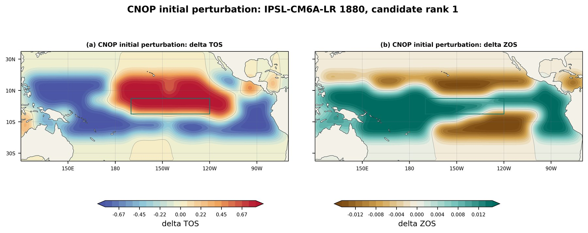
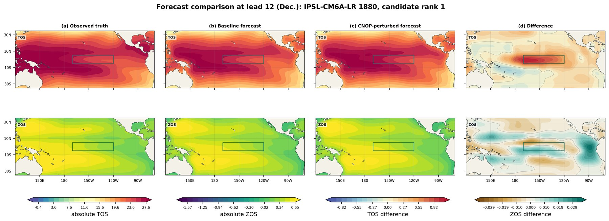
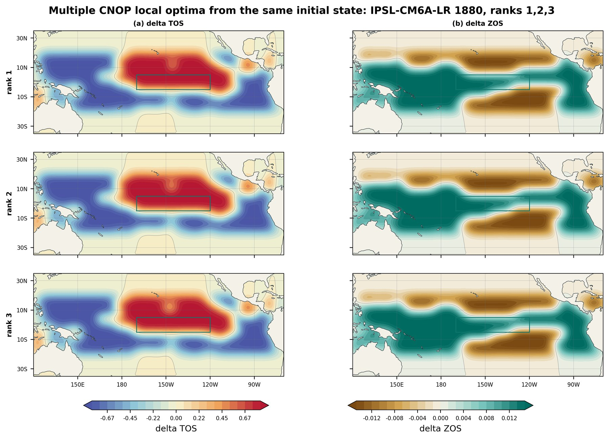
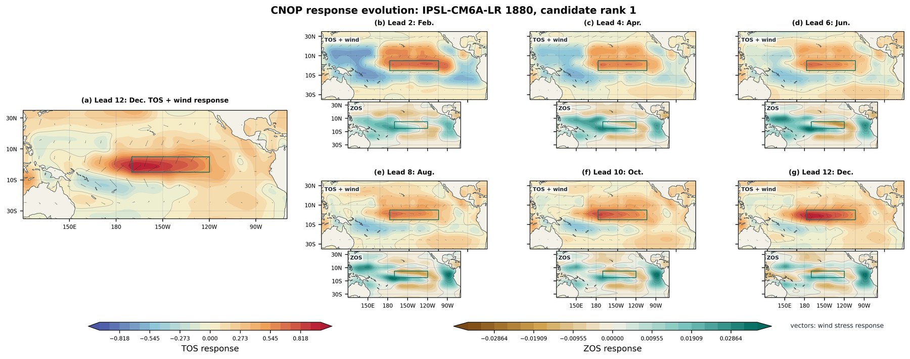
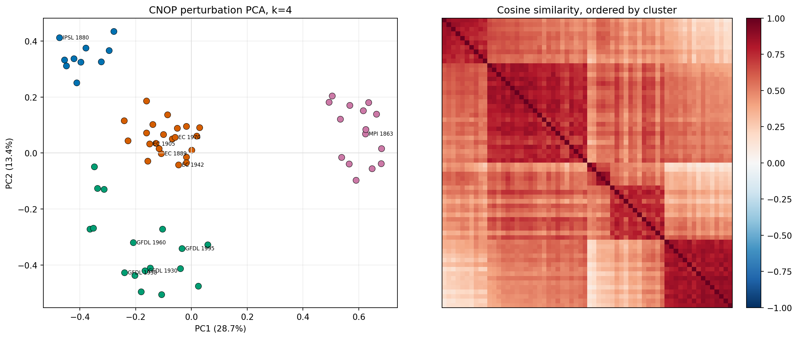
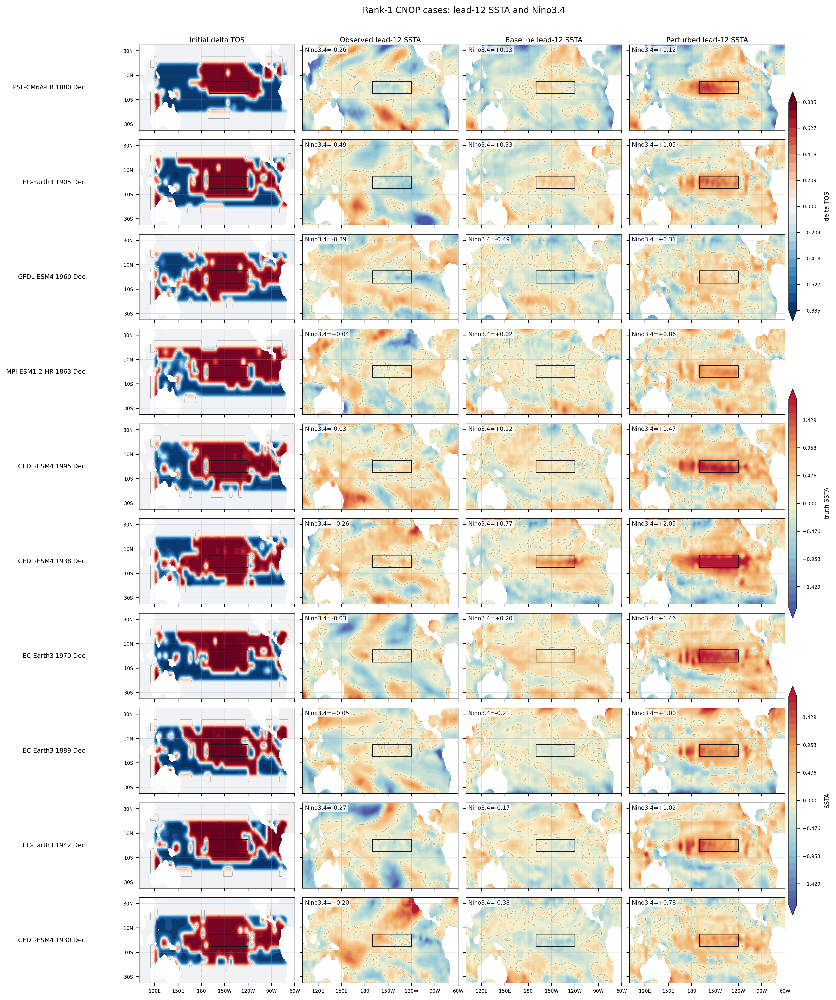

<p align="center">
  
</p>

<h1 align="center">WalkerNet</h1>

<p align="center">
  面向全球海气物理场的自回归预测模型，用预测场评估 ENSO 技巧。
</p>

<p align="center">
  
  
  
  
  
</p>

---

## 项目目标

WalkerNet 的目标是：

```text
用过去 12 个月的全球海气物理场，预测未来 1 个月的全球场；
再把预测场自回归接回输入窗口，滚动得到 1-18 个月预报；
最后从预测 tos 场计算 Niño3.4 anomaly ACC / RMSE。
```

模型训练坚持 **field-first**：模型不直接输出 ENSO 指数，而是先预报完整物理场，再从场里计算指数。

## 张量约定

输入输出固定为：

```text
x:      (B, 12, 4, 180, 360)
y_pred: (B,  1, 4, 180, 360)
```

四个变量顺序固定：

| Channel | Variable | Meaning |
|---:|---|---|
| 0 | `tos` | 海表温度 |
| 1 | `zos` | 海面高度 |
| 2 | `tauu` | 纬向风应力 |
| 3 | `tauv` | 经向风应力 |

网格统一为 1° 全球规则网格：

```text
H = 180
W = 360
lat = -89.5 ... 89.5
lon =   0.5 ... 359.5
```

## 模型接口

模型实现需要遵守：

```python
y_pred = model(x, target_month, rollout_step=None)
```

| Name | Shape | Note |
|---|---|---|
| `x` | `(B, 12, 4, 180, 360)` | 归一化后的历史窗口 |
| `target_month` | `(B,)` | 目标月份，取值 `1-12` |
| `rollout_step` | `(B,)` 或 `None` | 第几次自回归滚动 |
| `y_pred` | `(B, 1, 4, 180, 360)` | 下一月预测场 |

## 当前训练策略

当前主线实验使用 5 个 source 混合训练：

```text
CESM2
EC-Earth3
GFDL-ESM4
IPSL-CM6A-LR
MPI-ESM1-2-HR
```

一个样本内部始终来自同一个 source，不同样本会混合 shuffle。

rollout curriculum：

```text
epoch <= 22: 12-step rollout
epoch <= 26: 15-step rollout
epoch >  26: 18-step rollout
```

每个 lead 同等重要：

```text
L_total = mean(L_1, L_2, ..., L_K)
```

单个 lead 的 loss：

```text
L_k =
1.0 * L_field
+ 0.1 * L_tropical_pacific
+ 0.3 * L_nino34
+ 0.1 * L_nino34_structure
```

含义：

| Loss | 作用 |
|---|---|
| `L_field` | 四变量全球场误差，主目标 |
| `L_tropical_pacific` | 热带太平洋四变量场误差 |
| `L_nino34` | 从预测 `tos` 计算 Niño3.4 区域平均并约束 |
| `L_nino34_structure` | 约束 Niño3.4 区域内部冷暖结构 |

## Rollout Skill 口径

训练中保存 `best_skill.pt` 使用的是验证集上的 `rollout_skill`，它不是 loss，而是 Niño3.4 anomaly ACC 的简化选择指标。

当前配置：

```yaml
rollout_selection:
  leads: [6, 9, 12, 18]
  mode: "three_month_mean"
  score: "mean_acc"
```

计算流程：

```text
1. 从验证样本滚动预测到 18 个月，得到完整预测场。
2. 从每个月预测 tos 场中计算 Niño3.4 区域平均。
3. 减去对应 source、对应月份的 Niño3.4 气候态，得到 anomaly。
4. 对指定 lead 使用三个月滑动平均：
   lead 6  = mean(lead 4, 5, 6)
   lead 9  = mean(lead 7, 8, 9)
   lead 12 = mean(lead 10, 11, 12)
   lead 18 = mean(lead 16, 17, 18)
5. 分别计算 acc@6 / acc@9 / acc@12 / acc@18。
6. rollout_skill = mean(acc@6, acc@9, acc@12, acc@18)。
```

因此，`rollout_skill` 主要用于训练过程中快速选择 checkpoint；正式报告仍应同时查看每个 lead 的 ACC、RMSE 和空间场评估。

## 当前 Niño3.4 测试结果

以下结果来自 `best_skill.pt` 在 test split 上的 rollout 评测，评测样本数为 305，最大 lead 为 24 个月。模型训练课程最长到 18 个月，因此 lead 24 属于额外外推检验。

月尺度 Niño3.4 anomaly：

| Lead（月） | Model ACC | Model RMSE | Persistence ACC | Persistence RMSE |
|---:|---:|---:|---:|---:|
| 3 | 0.915 | 0.520 | 0.653 | 1.164 |
| 6 | 0.834 | 0.769 | 0.411 | 1.515 |
| 9 | 0.755 | 1.007 | 0.106 | 1.747 |
| 12 | 0.701 | 1.177 | -0.276 | 1.920 |
| 18 | 0.636 | 1.346 | -0.363 | 2.338 |
| 24 | 0.465 | 1.493 | -0.420 | 2.056 |

三个月滑动平均 Niño3.4 anomaly：

| Lead（月） | Model ACC | Model RMSE | Persistence ACC | Persistence RMSE |
|---:|---:|---:|---:|---:|
| 3 | 0.958 | 0.363 | 0.807 | 0.808 |
| 6 | 0.873 | 0.658 | 0.504 | 1.384 |
| 9 | 0.789 | 0.904 | 0.231 | 1.622 |
| 12 | 0.729 | 1.098 | -0.152 | 1.803 |
| 18 | 0.663 | 1.294 | -0.393 | 2.323 |
| 24 | 0.504 | 1.461 | -0.446 | 2.073 |

## CNOP 敏感扰动示例

当前 CNOP 实验使用已经训练好的 `best_skill.pt`，在同一个中性样本
`IPSL-CM6A-LR 1880` 上优化输入窗口第 12 个月的 `tos/zos` 扰动。
约束采用相对初始场物理量 L2 范数；下面几张 `docs/assets/cnop_3pct_*`
图片都来自这个 3% 约束实验：

```text
||delta_tos||_2 <= 3% * ||initial_tos||_2
||delta_zos||_2 <= 3% * ||initial_zos||_2
```

目标函数为最大化 lead-12 Niño3.4 anomaly 的变化量：

```text
J(delta) = Nino3.4_12(F(x + delta)) - Nino3.4_12(F(x))
```

该样本的 3% 约束结果：

| Item | Value |
|---|---:|
| baseline lead-12 Niño3.4 | -0.349 |
| CNOP lead-12 Niño3.4 | 0.510 |
| lead-12 gain | 0.859 |
| baseline max 3-month mean | -0.032 |
| CNOP max 3-month mean | 0.610 |

CNOP 本体，即实际加在输入第 12 个月上的 `delta_tos / delta_zos`：

<p align="center">
  
</p>

真值、原始预报、叠加 CNOP 后预报、二者差值的 lead-12 对比：

<p align="center">
  
</p>

同一初始场、同一目标函数下，从多个随机初值重复优化得到的前三个候选扰动。
这里的 `rank` 只表示按目标函数值从高到低排序，不是物理模态编号。当前 rank 1-3
形态和目标函数值都很接近，说明这个设置更像是收敛到同一个主导敏感方向；
这张图主要用于检查优化重复性，暂时不宜解读为“多个不同局地最优模态”：

<p align="center">
  
</p>

`F(x + delta) - F(x)` 的逐月响应演化：

<p align="center">
  
</p>

## CNOP 64 样本聚类实验

为了避免只看单个个例，新增了一个 64 样本实验。筛选条件是：

1. 目标年一月至十二月的 truth 不发生 ENSO，即 observed max 3-month `|Niño3.4 anomaly| <= 0.5`。
2. baseline 与 truth 接近，按 12 个月 `Niño3.4 anomaly RMSE` 从小到大选样。

CNOP 设置沿用 event-based joint TOS/ZOS L2 constraint，并取 `constraint_scale = 0.4`。
64 个样本整体结果如下：

| Metric | Mean | Median | Min | Max |
|---|---:|---:|---:|---:|
| observed max 3-month `|Niño3.4|` | 0.366 | 0.380 | 0.126 | 0.500 |
| baseline lead-12 Niño3.4 | -0.066 | -0.051 | -0.826 | 1.013 |
| CNOP lead-12 Niño3.4 | 0.821 | 0.823 | -0.225 | 2.142 |
| lead-12 gain | 0.887 | 0.867 | 0.492 | 1.344 |
| baseline max 3-month Niño3.4 | 0.212 | 0.147 | -0.347 | 0.973 |
| CNOP max 3-month Niño3.4 | 1.005 | 0.915 | 0.253 | 2.020 |
| max 3-month gain | 0.792 | 0.796 | 0.377 | 1.192 |

64 个 CNOP 初始扰动按无量纲 `delta_norm` 聚类，使用所有 case 共同有效海洋格点：

| Cluster | Count | Mean lead-12 gain | Mean max 3-month gain |
|---:|---:|---:|---:|
| 1 | 10 | 0.955 | 0.800 |
| 2 | 22 | 0.877 | 0.792 |
| 3 | 17 | 0.933 | 0.784 |
| 4 | 15 | 0.804 | 0.797 |

这个结果说明：在 `0.4 constraint` 下，CNOP 对非 ENSO 且 baseline 预报较接近 truth
的 64 个样本都能稳定推高 Niño3.4；不同 cluster 更像是不同扰动形态原型，而不是有效/无效两类。

<p align="center">
  
</p>

从 4 个 cluster 中先取中心代表，再用较强 lead-12 gain 样本补足，得到 10 个代表样本：

<p align="center">
  
</p>

完整数值表保存在：

- `docs/assets/cnop64_scale04_summary_forecast_clim.csv`
- `docs/assets/cnop64_scale04_cluster_summary.csv`

## 常用命令

单卡训练：

```bash
python -m src.train --config configs/server_3090_mixed5.yaml
```

DDP 训练：

```bash
CUDA_VISIBLE_DEVICES=0,1,2,3,4,5,6,7 \
python -m torch.distributed.run --nproc_per_node=8 \
  -m src.train \
  --config configs/server_3090_mixed5_ddp8.yaml \
  --num-workers 2
```

只加载模型权重作为新实验起点：

```bash
python -m src.train \
  --config configs/server_3090_mixed5.yaml \
  --init-checkpoint /path/to/best_skill.pt
```

完整恢复训练状态：

```bash
python -m src.train \
  --config configs/server_3090_mixed5.yaml \
  --resume /path/to/latest.pt
```

## 数据处理

原始数据需要先重网格到 1°：

```bash
bash scripts/data/remap_to_1x1.sh
```

检查重网格结果：

```bash
python scripts/data/check_remapped_data.py --data-dir data_1x1
```

大文件目录不应提交到 GitHub，例如：

```text
data_1x1/
cmip6_1x1/
cache/
outputs/
checkpoints*/
```

## 代码结构

```text
configs/          训练与评测配置，索引见 configs/README.md
docs/             架构、方法与实验结果，索引见 docs/README.md
scripts/data/     重网格与数据校验
scripts/train/    训练、冒烟测试与 GPU 等待任务
scripts/eval/     常规评测可视化
scripts/cnop/     CNOP 优化、分析与实验流水线
src/              Dataset、WalkerNet、训练和评测核心代码
tests/            模型、数据集、Trainer 与 DDP 测试
```

## 当前状态

- 已支持 5-source 混合训练。
- 已支持 12 -> 15 -> 18 的 rollout curriculum。
- 已支持 field-first 的 Niño3.4 anomaly ACC/RMSE 评测。
- 当前推荐实验从历史 `best_skill.pt` 使用 `--init-checkpoint` 开始，而不是恢复旧 optimizer。
